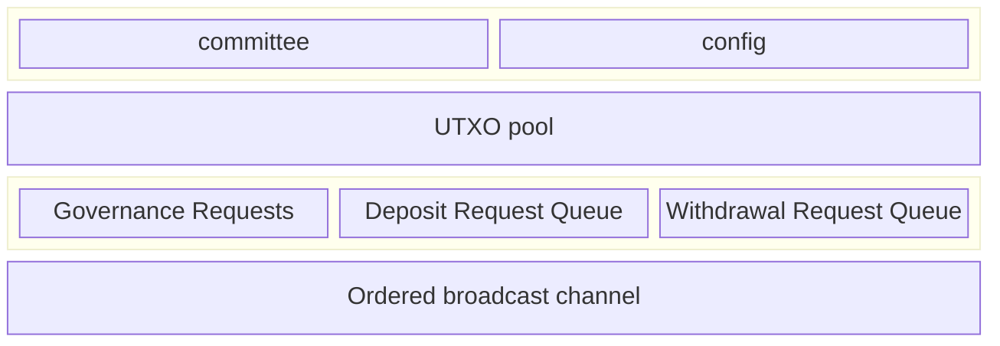

Every committee member is responsible for running a Hashi node service. Each
Hashi node exposes an HTTP service, secured by Transport Layer Security (TLS)
using a self-signed cert (the ed25519 public key is available in the Hashi
System State object), and serves a gRPC `HashiService`.

### Health and readiness endpoints

The Hashi node HTTP service exposes the following probe endpoints:

- **`/health`:** A liveness probe endpoint. Returns a successful response if the service is running.
- **`/ready`:** A readiness probe endpoint. Returns a successful response only if the node's `SigningManager` is available for the current epoch, indicating the node is fully ready to participate in the protocol. This is useful for orchestration systems (for example, Kubernetes) to determine when the node is ready to accept traffic.

## Sui contracts

- The Hashi Move packages are published as normal packages. The Hashi packages
  are not system packages, and are not part of the Sui framework.

## Stateless

A main goal of this design is to make the Hashi service as stateless as
possible. Outside of any cryptographic material required for participating in
the protocol, any state critical for the functioning of the service must be
stored on Sui as part of the live object set. Knowledge of any historical
transactions or events previously emitted must not be needed for correct
operation of the service.

The set of data structures and state kept onchain is as follows:

