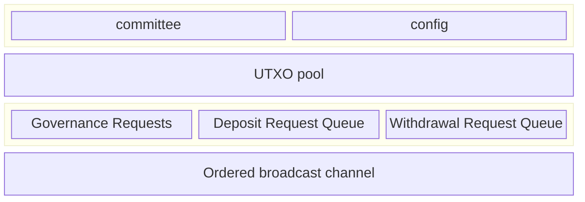

Every committee member is responsible for running a Hashi node service. Each
Hashi node exposes an HTTP service, secured by Transport Layer Security (TLS)
using a self-signed cert (the ed25519 public key is available in the Hashi
System State object), and serves a gRPC `HashiService`.

## HashiService RPCs

The `HashiService` gRPC interface exposes the following RPCs:

- **SignCommitteeTransition:** Peers sign committee transition messages using their historical epoch BLS keys. The leader invokes this RPC on other committee members to collect signatures needed to advance the guardian committee to match the current on-chain epoch.

## Committee transitions

When the on-chain epoch changes, the guardian committee must transition to
reflect the updated committee composition. The leader drives this handoff
process:

1. The leader detects that the on-chain epoch has advanced beyond the current
   guardian committee epoch.
2. The leader calls `SignCommitteeTransition` on each peer, requesting a
   signature over the new committee state.
3. Each peer signs the transition message using its historical epoch BLS key
   that corresponds to the epoch in which the transition originates.
4. Once the leader collects enough signatures, it finalizes the guardian
   committee handoff so that the guardian committee matches the on-chain epoch.

This mechanism ensures that the guardian committee stays in sync with the
on-chain committee state and that transitions are authenticated by the members
of the originating epoch.

## Sui contracts

- The Hashi Move packages are published as normal packages. The Hashi packages
  are not system packages, and are not part of the Sui framework.

## Stateless

A main goal of this design is to make the Hashi service as stateless as
possible. Outside of any cryptographic material required for participating in
the protocol, any state critical for the functioning of the service must be
stored on Sui as part of the live object set. Knowledge of any historical
transactions or events previously emitted must not be needed for correct
operation of the service.

The set of data structures and state kept onchain is as follows:

