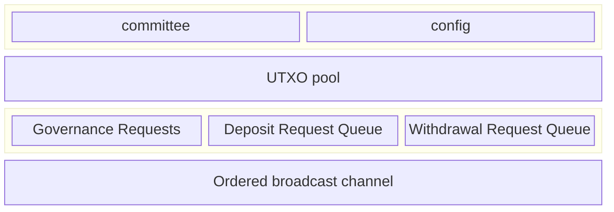

Every committee member is responsible for running a Hashi node service. Each
Hashi node exposes an HTTP service, secured by Transport Layer Security (TLS)
using a self-signed cert (the ed25519 public key is available in the Hashi
System State object), and serves a gRPC `HashiService`.

## gRPC interface

The `HashiService` exposes the following RPCs:

### UpdateCommittee

Used for committee handoff at epoch changes. This RPC accepts a
`SignedCommitteeTransition`, verifies the outgoing committee's threshold
signature, swaps the in-memory committee, and logs the transition to S3.

## Sui contracts

- The Hashi Move packages are published as normal packages. The Hashi packages
  are not system packages, and are not part of the Sui framework.

## Stateless

A main goal of this design is to make the Hashi service as stateless as
possible. Outside of any cryptographic material required for participating in
the protocol, any state critical for the functioning of the service must be
stored on Sui as part of the live object set. Knowledge of any historical
transactions or events previously emitted must not be needed for correct
operation of the service.

Ephemeral in-memory state, such as the current committee held by each node, and
operational data, such as S3 audit logs, are exceptions to the onchain state
principle. The in-memory committee is validated against onchain state through
threshold signature verification during the `UpdateCommittee` RPC, ensuring
consistency with the committee recorded on Sui.

The set of data structures and state kept onchain is as follows:

