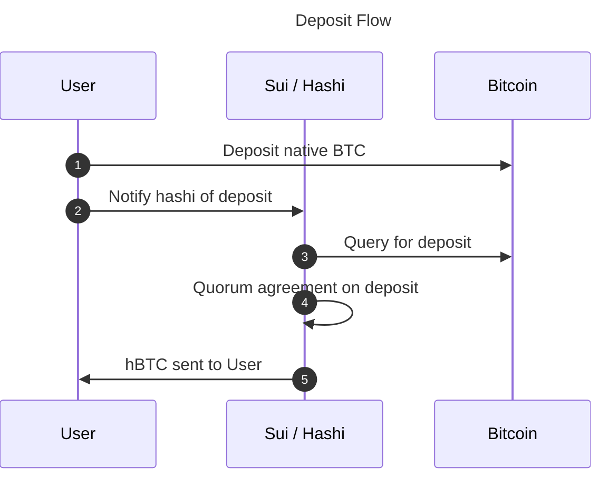
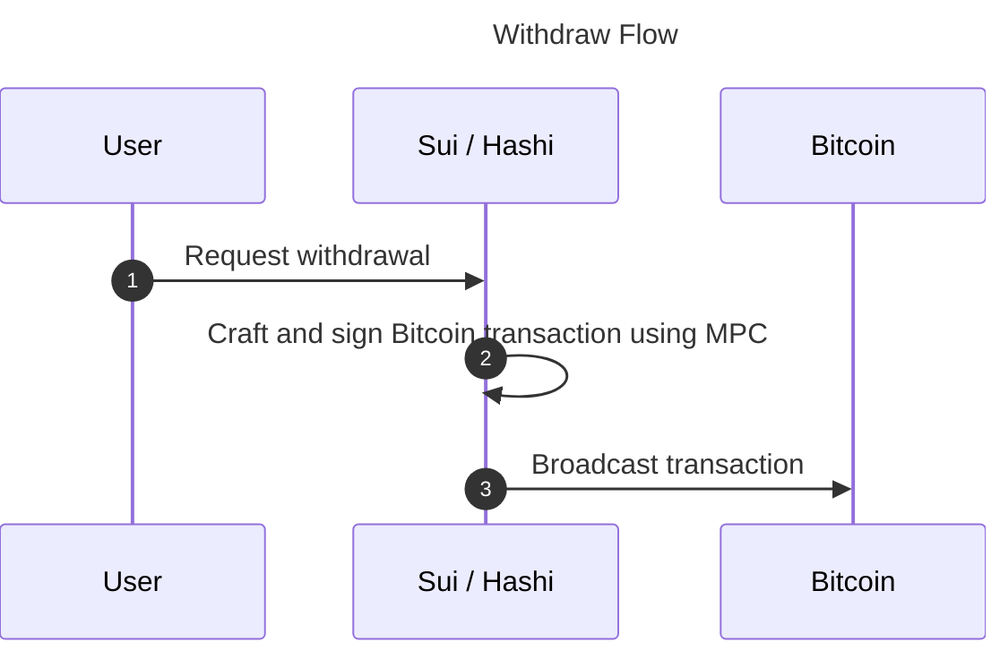

# User Flows

*[Documentation index](/hashi/design/llms.txt) · [Full index](/hashi/design/llms-full.txt)*

> End-to-end deposit and withdrawal flows for users moving BTC between Bitcoin and Sui through Hashi.

There are two main user flows for interacting with `hashi`: deposits and
withdrawals.

## Deposit flow

To use `BTC` on Sui (for example, as collateral for a loan), you must
deposit your `BTC` to a Hashi MPC-controlled Bitcoin address.

### BTC deposit address

Every Sui address has its own unique Hashi Bitcoin deposit address. See
[Bitcoin Address Scheme](/address-scheme) for the full derivation
details.

### Deposit

After your deposit address is determined, you can initiate a deposit to
Hashi.

1. Broadcast a Bitcoin transaction depositing `BTC` into your unique deposit
   address.
1. Notify Hashi of the deposit by submitting a transaction to Sui that
   includes the deposit transaction ID.
1. Hashi nodes query Bitcoin and watch for confirmation of the deposit
   transaction.
1. Hashi nodes communicate, waiting until a quorum has confirmed the deposit
   (after X block confirmations).
1. Hashi confirms the deposit onchain, minting the equivalent amount of
   `hBTC` and transferring it to your Sui address. You can then immediately
   use the `hBTC` to interact with a DeFi protocol. For example, you can use
   the `hBTC` as collateral for a loan in `USDC`.

For a detailed breakdown of each phase, see [Deposit](/deposit).

## Withdraw flow

After you decide you want your `BTC` back on Bitcoin (for example, after you
pay off your loan), you can initiate a withdrawal.

### Withdraw

1. You send a transaction to Sui with the amount of `hBTC` you want to
   withdraw and the Bitcoin address you want to withdraw to.
1. Hashi picks up the withdrawal request and crafts a Bitcoin transaction
   that sends the requested `BTC` (minus fees) to the provided Bitcoin
   address, then uses MPC to sign the transaction.
1. The transaction is broadcast to the Bitcoin network.

For a detailed breakdown of each phase, see [Withdraw](/withdraw).
